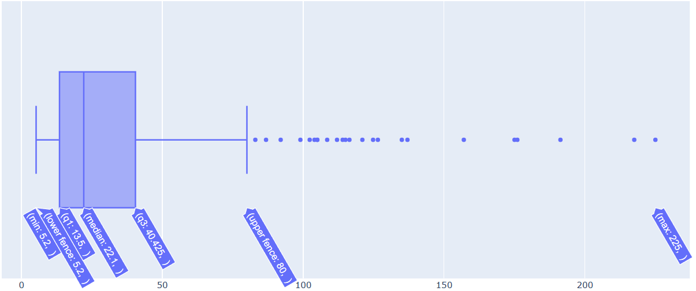
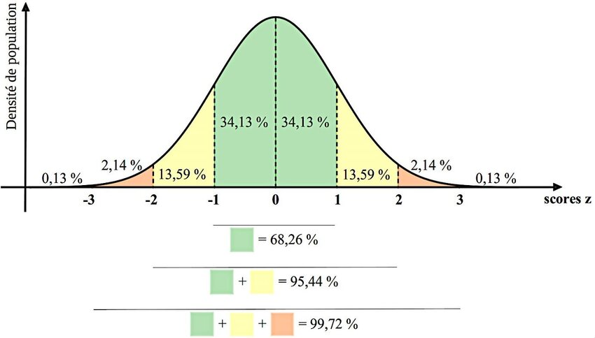

# 📊 Rapprochement ERP & Boutique en ligne

Projet réalisé dans le but d'améliorer la visibilité des ventes en ligne et la fiabilité des données produits.

## 🚀 Objectif du projet

Mettre en place un processus de rapprochement de données entre l’ERP et la boutique en ligne afin de :

- Fusionner les exports produits (ERP + Web) grâce au mapping product_id ↔ SKU.

- Analyser le chiffre d’affaires par produit et le CA en ligne.

- Réaliser une analyse exploratoire des prix pour détecter d’éventuelles valeurs aberrantes.

- Produire un dataset consolidé exportable en Excel pour partage.

## 🛠️ Outils & Librairies

- Jupyter Notebook : exploration et documentation du travail

- Python : traitement et nettoyage de données

- Pandas : fusion, manipulation et analyse des datasets

- Plotly : visualisations interactives des anomalies de prix
  
- Numpy : calculs statistiques

- Chardet : identification de l'encodage csv

## 📂 Données utilisées

- `erp.xlsx` → références produits, prix, stock

- `web.xlsx` → informations produits et ventes en ligne

- `caracteristiques_vins.csv` → caractéristiques complémentaires (optionnel)

## 🧠 Méthodologie des analyses 

### Détermination des valeurs aberrantes

- 📊 Exploration par la visualisation de données : interprétation de graphiques Boite à moustache de la répartition des prix
  

  
  
- 🧮 Exploration par l'utisation de méthodes statistique :
  
     - **Méthode du Z-Score** : mesure à quelle distance une valeur se trouve de la moyenne, exprimée en nombre d’écarts-types. Un z-score proche de 0 = valeur                                     proche de la moyenne. Un z-score élevé (positif ou négatif) = valeur anormalement éloignée, donc potentiellement une valeur                                         aberrante. La formule du z-score est **𝑧 = (𝑥−𝜇)/𝜎** où **x** = la valeur observée, **𝜇** = la moyenne de l’échantillon et **𝜎** =                                  l’écart-type. On interprète ensuite le résultat en fonction d'une courbe normale :
  

  
  
     - **Identification par l'intervalle interquartile** : on calcule nos quartiles (Q1 et Q3) ainsi que notre interquartile (IQR), puis on calcule notre                                                                      **valeur_max** = q3 + (1.5 * iqr) et **notre valeur_min** = q1 - (1.5 * iqr). On regroupe ensuite en                                                                tant que valeurs aberrantes toutes les valeurs en dehors de l'intervalle [VMin ; VMax]. 

### Analyse du CA

- On calcule le CA (prix*quantité) par article et on classe par ordre décroissant.
- On regarde la part du CA pour chaque article et on regarde ceux qui y contribuent le plus.
- On calcule ensuite le CA cumulé pour voir quels produits réalisent 80% du CA.

### Analyses des volumes de ventes 
 
- On calcule le volume de vente par article et on classe par ordre décroissant.
- On regarde la part du volume total pour chaque article et on regarde ceux qui y contribuent le plus.
- On calcule ensuite le volume cumulé pour voir quels produits réalisent 80% des ventes en quantité.

## 📈 Livrables

- 📑 Dataset final fusionné (df_boutique_web.xlsx)

- 📊 Notebook complet
  

## 💡 Résultats obtenus

- Consolidation des données ERP + Web + Caracteristiques_vins en une base unique

- Calcul CA total et par produit

- Identification de valeurs aberrantes dans les prix, illustrées par graphiques Plotly
